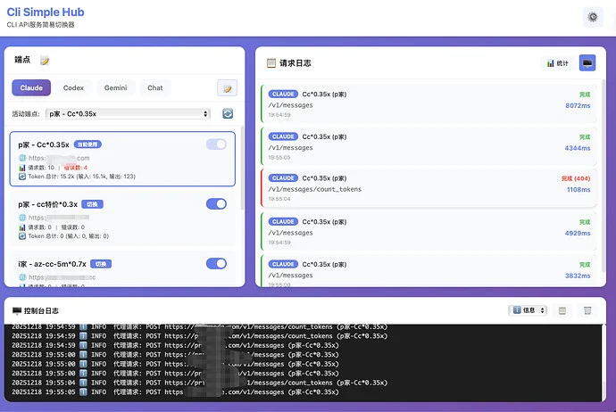
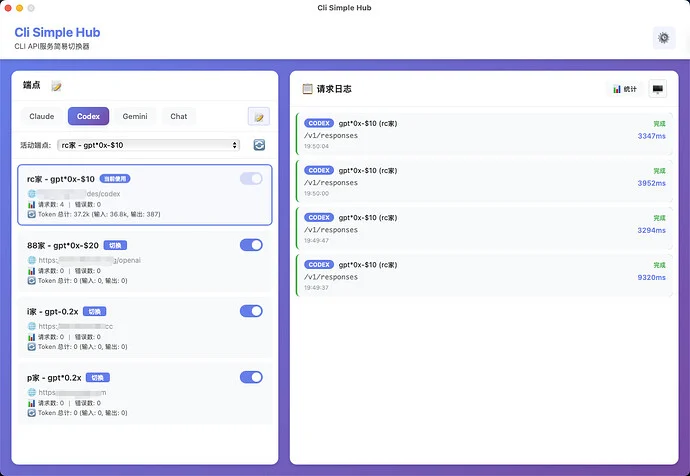
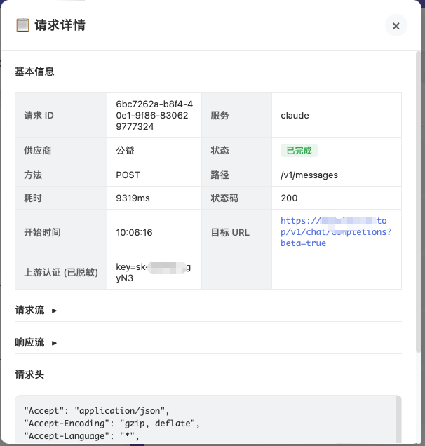
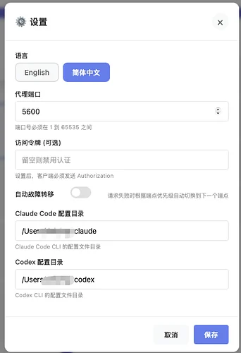
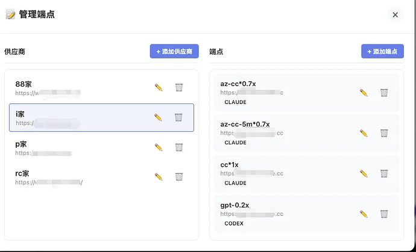
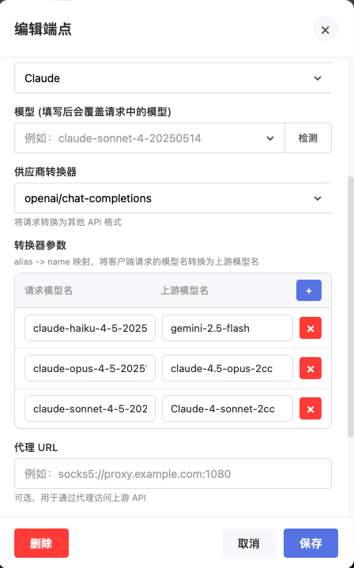
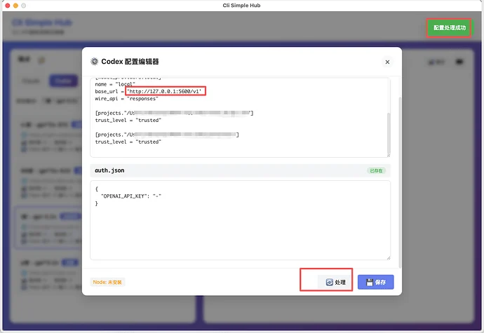
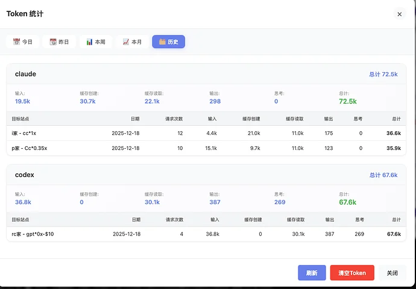
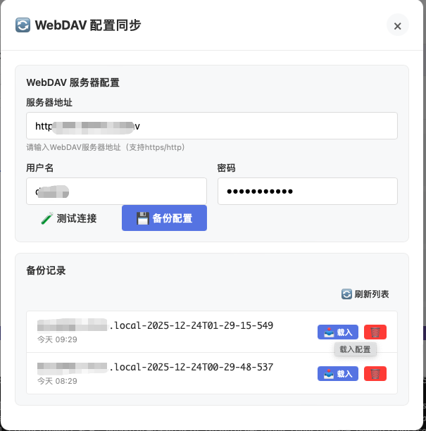

# Cli Simple Hub
CLI API服务简易切换器

## 功能特性

- **多端点轮换**：自动故障转移，一个失败自动切换下一个
- **多种cli支持**：支持 Claude、OpenAI、Gemini CLI请求中转
- **实时统计**：按渠道进行请求数、错误数、Token 用量监控
- **跨平台**：Windows、macOS、Linux

## 快速开始

### 1. 下载安装

[下载最新版本](https://github.com/cgistar/clisimplehub/releases)

- **Windows**: 解压后运行 `cliSimpleHub.exe`
- **macOS**: 解压后移动到「应用程序」，首次运行右键点击 → 打开
- **Linux**: `tar -xzf cliSimpleHub-v1.0.0-linux-amd64.tar.gz && ./cliSimpleHub`


<table>
  <tr>
    <td align="center"></td>
    <td align="center"></td>
  </tr>
</table>


### 2. 系统配置
- 点击主界面右上角的⚙️图标，进入配置界面，配置当前系统的端口、以及claude codex的配置文件路径
- 如果需要 「自动故障转移」，请选中这个功能
- 令牌默认为空（本机运行）



### 3. 添加端点
- 主界面点击 **「📝端点配置」**
- 先填写供应商（渠道商）名称、URL地址等
- 点击某个供应商，点击添加端点，填写名称、API 地址、密钥、选择接口类型（claude/openai/gemini）

<table>
  <tr>
    <td align="center"></td>
    <td align="center"></td>
  </tr>
</table>

### 3.1 端点转换器（transformer）
当你的 **客户端接口类型** 与 **上游接口类型** 不一致时，可以在 `config.json` 的 `vendors[].endpoints[]` 增加 `transformer` 字段，让请求按 `interfaceType -> transformer -> 目标 interfaceType` 转换后再转发。

示例：Claude Code（`/v1/messages`）请求转到 OpenAI Chat Completions 上游
```json
{
  "interfaceType": "claude",
  "apiUrl": "https://YOUR_UPSTREAM_OPENAI_BASE",
  "transformer": "openai/chat-completions",
  "models": [{"alias": "claude-opus-4-5-20251101", "name": "claude-4.5-opus"}]
}
```

已内置的 `transformer`：
- `openai/chat-completions`：Claude -> OpenAI Chat Completions（目标 `interfaceType=chat`）
- `openai/responses`：Claude -> OpenAI Responses（目标 `interfaceType=codex`）
- `gemini`：Claude -> Gemini GenerateContent（目标 `interfaceType=gemini`）

额外：`codex`（OpenAI Responses）也支持 `openai/chat-completions`，用于将 `/v1/responses` 请求转到只支持 `/v1/chat/completions` 的上游。

模型替换仍通过 `endpoints.model` / `endpoints.models` 生效（转换器不做模型名硬编码）。


### 4. cli 配置编辑器
- 本软件支持一键将 cli 配置 改为当前软件的访问地址
- 选中 claude 或 codex 的tag页，然后点击右边的 **「📝Cli 配置」**
- 在配置界面中可以看到当前系统的配置项，如果没有，软件将会创建一个
- 点击右下角的 **「处理」** 按钮，会将配置文件中的接口地址变更为当前软件的 http://127.0.0.1:PORT



### 5. 统计功能
- 软件会将请求的token按 **供应商-类型** 的方式进行归类统计

<table>
  <tr>
    <td align="center"></td>
    <td align="center"></td>
  </tr>
</table>

### 6. webdav同步
- 支持将配置同步到 webdav 上
- 软件不会保存 webdav 服务器配置到配置文件


