# Cli Simple Hub
CLI API服务简易切换器

## 功能特性

- **多端点轮换**：自动故障转移，一个失败自动切换下一个
- **模型路由**：根据请求中的模型名自动路由到指定端点，无需手动切换
- **多种cli支持**：支持 Claude、OpenAI、Gemini CLI请求中转
- **实时统计**：按渠道进行请求数、错误数、Token 用量监控
- **跨平台**：Windows、macOS、Linux

## 快速开始

### 1. 下载安装

[下载最新版本](https://github.com/cgistar/clisimplehub/releases)

- **Windows**: 解压后运行 `cliSimpleHub.exe`
- **macOS**: 解压后移动到「应用程序」，首次运行右键点击 → 打开
- **Linux**: `tar -xzf cliSimpleHub-v1.0.0-linux-amd64.tar.gz && ./cliSimpleHub`


<table>
  <tr>
    <td align="center">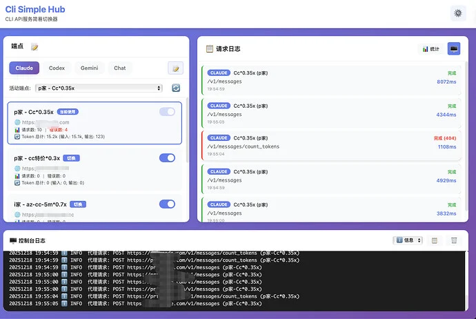</td>
    <td align="center">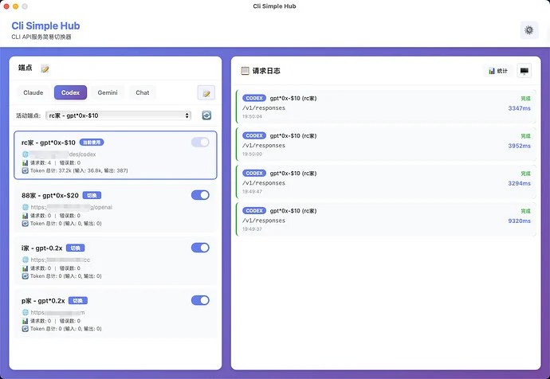</td>
  </tr>
</table>
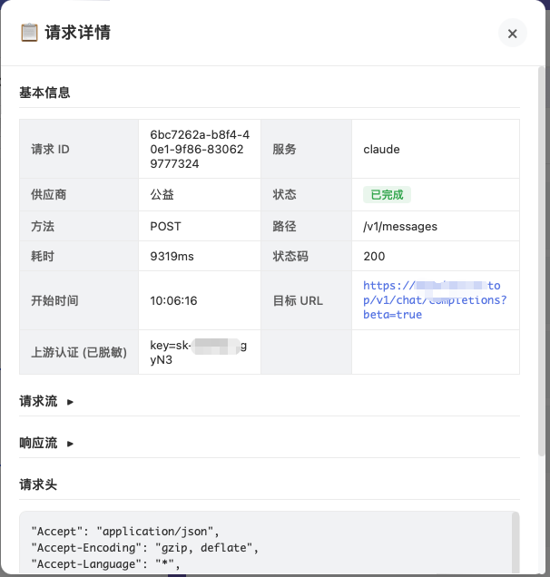

### 2. 系统配置
- 点击主界面右上角的⚙️图标，进入配置界面，配置当前系统的端口、以及claude codex的配置文件路径
- 如果需要 「自动故障转移」，请选中这个功能
- 令牌默认为空（本机运行）

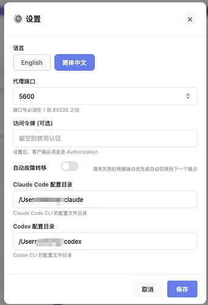

### 3. 添加端点
- 主界面点击 **「📝端点配置」**
- 先填写供应商（渠道商）名称、URL地址等
- 点击某个供应商，点击添加端点，填写名称、API 地址、密钥、选择接口类型（claude/openai/gemini）

<table>
  <tr>
    <td align="center">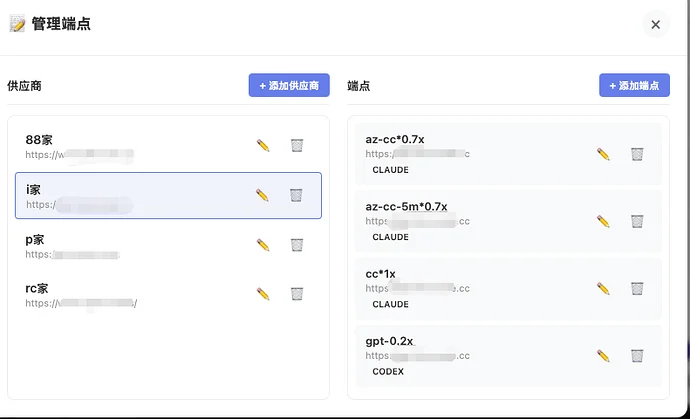</td>
    <td align="center">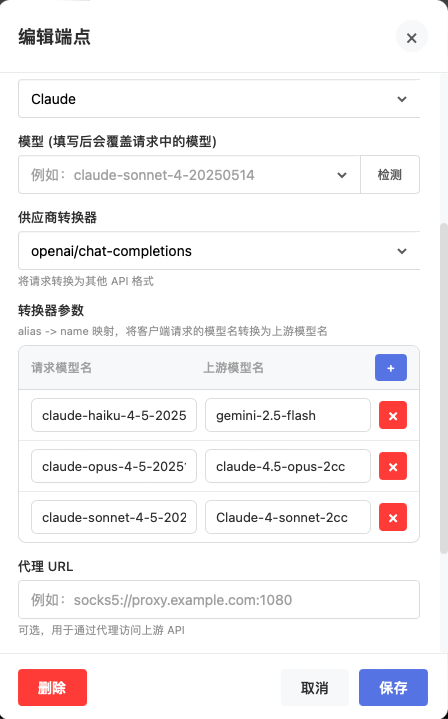</td>
  </tr>
</table>

### 3.1 端点转换器（transformer）
当你的 **客户端接口类型** 与 **上游接口类型** 不一致时，可以在 `config.json` 的 `vendors[].endpoints[]` 增加 `transformer` 字段，让请求按 `interfaceType -> transformer -> 目标 interfaceType` 转换后再转发。

示例：Claude Code（`/v1/messages`）请求转到 OpenAI Chat Completions 上游
```json
{
  "interfaceType": "claude",
  "apiUrl": "https://YOUR_UPSTREAM_OPENAI_BASE",
  "transformer": "openai/chat-completions",
  "models": [{"alias": "claude-opus-4-5-20251101", "name": "claude-4.5-opus"}]
}
```

已内置的 `transformer`：
- `openai/chat-completions`：Claude -> OpenAI Chat Completions（目标 `interfaceType=chat`）
- `openai/responses`：Claude -> OpenAI Responses（目标 `interfaceType=codex`）
- `gemini`：Claude -> Gemini GenerateContent（目标 `interfaceType=gemini`）

额外：`codex`（OpenAI Responses）也支持 `openai/chat-completions`，用于将 `/v1/responses` 请求转到只支持 `/v1/chat/completions` 的上游。

模型替换仍通过 `endpoints.model` / `endpoints.models` 生效（转换器不做模型名硬编码）。

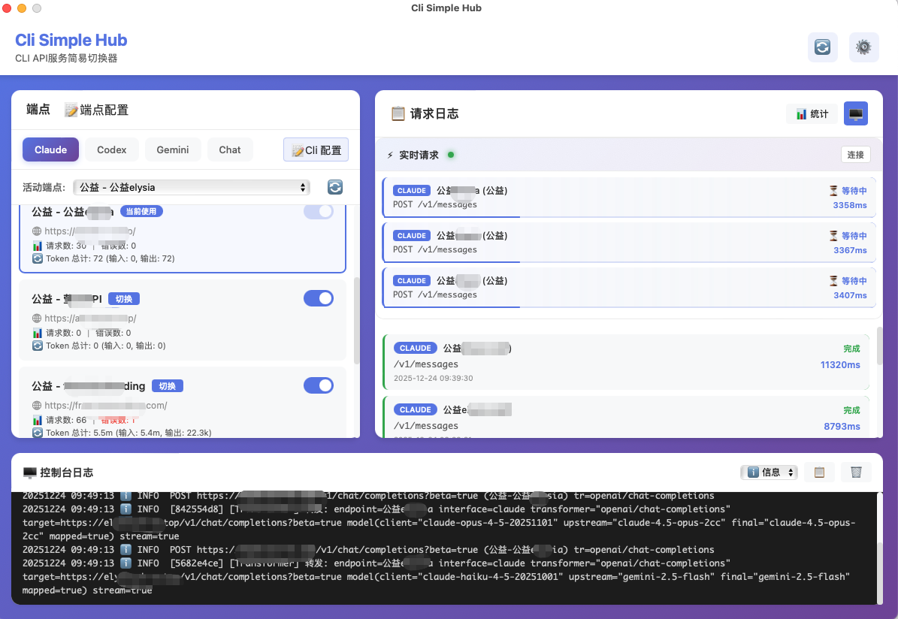

### 3.2 模型路由（Routes）

当同一接口类型（如 claude）配置了多个端点时，默认所有请求都发往「活动端点」。**模型路由** 可以根据客户端请求中携带的模型名，自动将请求分发到不同端点，无需手动切换。

#### Routes 与 Model / Models 的区别

端点有三个模型相关字段，职责不同：

| 字段 | 作用 | 阶段 |
|------|------|------|
| `routes` | **路由选择** — 决定请求发到哪个端点 | 选择端点时 |
| `models` | **名称映射** — 将客户端模型名转换为上游模型名 | 转发请求前 |
| `model` | **模型覆盖** — 强制所有请求使用指定模型 | 转发请求前 |

完整流程：
```
客户端请求 (model: "claude-sonnet-4-5-20250929")
  → routes 匹配 → 选中端点 A
  → models 映射 → "claude-sonnet-4-5-20250929" → "claude-4.5-sonnet"
  → 转发到上游 API
```

#### 配置示例

在端点配置中添加 `routes` 字段：

```json
{
  "endpoints": [
    {
      "name": "Sonnet 专用",
      "apiUrl": "https://api.provider-a.com",
      "interfaceType": "claude",
      "enabled": true,
      "routes": ["claude-sonnet-4-5-20250929"]
    },
    {
      "name": "Opus 专用",
      "apiUrl": "https://api.provider-b.com",
      "interfaceType": "claude",
      "enabled": true,
      "active": true,
      "routes": ["claude-opus-4-5-20251101"]
    }
  ]
}
```

#### 路由规则

- 请求携带 `model: "claude-sonnet-4-5-20250929"` → 匹配到 **Sonnet 专用**（routes 包含该模型）
- 请求携带 `model: "claude-opus-4-5-20251101"` → 匹配到 **Opus 专用**
- 请求携带 `model: "claude-haiku-4-5-20251001"` → 无匹配，回退到**活动端点**（Opus 专用）
- 请求未携带 model → 回退到**活动端点**

多个端点匹配同一模型时，按 **活动端点优先 → 优先级数值小优先** 排序。

#### GUI 配置

在端点编辑表单中，「模型路由」区域可以添加/删除路由条目，每条填写一个模型名。

### 4. cli 配置编辑器
- 本软件支持一键将 cli 配置 改为当前软件的访问地址
- 选中 claude 或 codex 的tag页，然后点击右边的 **「📝Cli 配置」**
- 在配置界面中可以看到当前系统的配置项，如果没有，软件将会创建一个
- 点击右下角的 **「处理」** 按钮，会将配置文件中的接口地址变更为当前软件的 http://127.0.0.1:PORT

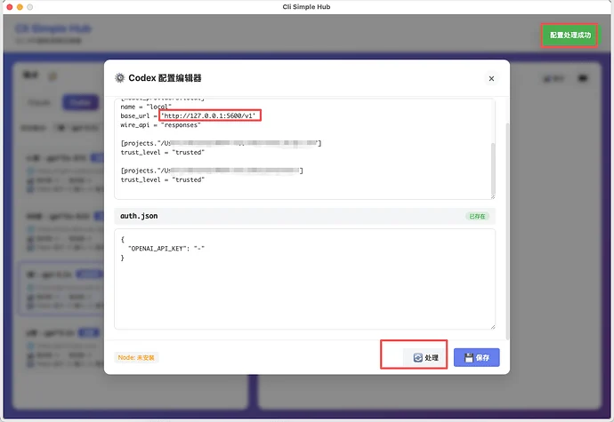

### 5. 统计功能
- 软件会将请求的token按 **供应商-类型** 的方式进行归类统计

<table>
  <tr>
    <td align="center">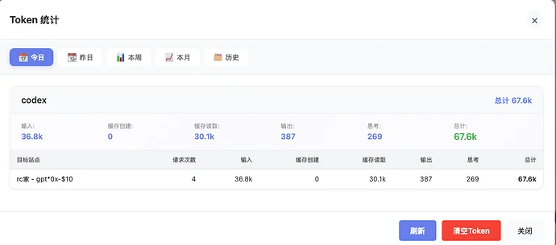</td>
    <td align="center">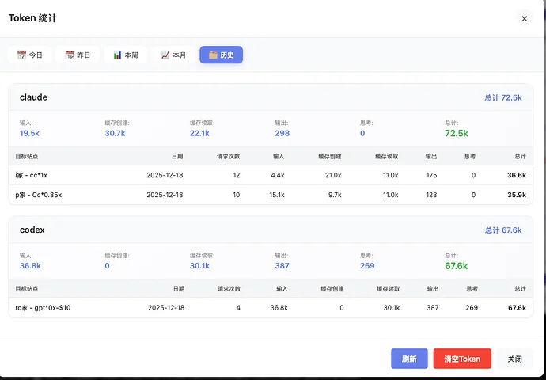</td>
  </tr>
</table>

### 6. webdav同步
- 支持将配置同步到 webdav 上
- 软件不会保存 webdav 服务器配置到配置文件

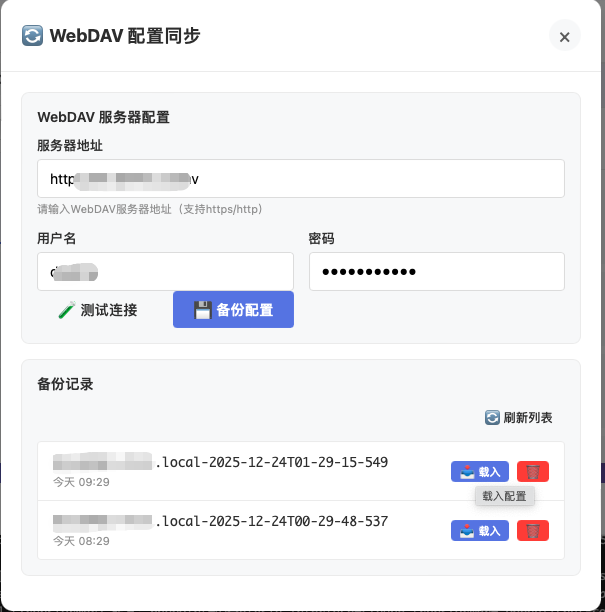

## 无头模式（Headless Server）

无头模式允许在没有图形界面的环境（如服务器、Docker）中运行代理服务。

### Docker 部署（推荐）

#### 1. 准备工作

在项目根目录创建数据目录并设置权限：

```bash
# 方式 1：修改目录所有者为 UID 1000（推荐）
mkdir -p ./data
sudo chown -R 1000:1000 ./data
```

**权限说明**：
- 容器内以 `appuser` (UID 1000) 运行
- 方式 1 更安全，确保只有 UID 1000 可以写入
- 方式 2 允许所有用户写入，适合测试环境

#### 2. 构建并启动容器

```bash
# 使用 docker-compose 启动
docker-compose up -d --build

# 查看日志
docker-compose logs -f

# 停止服务
docker-compose down
```

#### 3. 配置说明

编辑 `docker-compose.yml` 设置环境变量：

```yaml
services:
  clisimplehub-server:
    environment:
      PORT: "5600"
      LISTEN_ADDR: "0.0.0.0"
      DATA: "/data"
      API_KEY: "your-secret-key-here"  # 取消注释并设置您的 API Key
    volumes:
      - ./data:/data  # 配置文件将保存在 ./data 目录
```

**重要提示**：
- ✅ 首次启动前必须创建 `./data` 目录
- ✅ 配置文件会自动创建在 `./data/config.json`
- ✅ 统计数据保存在 `./data/data.sqlite`
- ⚠️ 生产环境强烈建议设置 `API_KEY` 环境变量

#### 4. 验证部署

```bash
# 检查服务状态
curl http://localhost:5600/health

# 测试 API（需要 API Key）
curl http://localhost:5600/kiro/getUsage \
  -H "Authorization: Bearer your-secret-key"
```

### 本地启动无头模式

```bash
# 使用默认配置启动
go run ./cmd/server

# 或使用环境变量配置
PORT=5600 CONFIG_PATH=/path/to/config.json go run ./cmd/server
```

### 环境变量

- `PORT`: 代理服务器端口（默认：5600）
- `CONFIG_PATH`: config.json 文件路径
- `LISTEN_ADDR`: 监听地址（默认：0.0.0.0，Docker 环境推荐）
- `API_KEY`: API 认证密钥（**最高优先级**，覆盖 config.json 中的配置）
- `DATA`: 数据目录（配置文件备用位置）

**优先级说明**：
- `API_KEY` 环境变量优先级高于 `config.json` 中的 `appConfig.apiKey`
- 如果设置了 `API_KEY` 环境变量，将忽略配置文件中的 apiKey
- 适用于 Docker 部署或需要动态配置的场景

### API 认证

无头模式支持通过 API Key 保护管理接口。可以通过以下两种方式配置：

**方式 1：环境变量（推荐用于 Docker）**
```bash
API_KEY=your-secret-key go run ./cmd/server
```

**方式 2：config.json 配置**
```json
{
  "appConfig": {
    "apiKey": "your-secret-key"
  }
}
```

**优先级**：环境变量 `API_KEY` > `config.json` 中的 `appConfig.apiKey`

**需要认证的接口**：

- `POST /kiro/config` - Kiro 配置更新
- `GET /kiro/getUsage` - Kiro 使用量查询
- `GET/POST /reload` - 配置重载
- `POST /endpoint` - 端点管理

**认证方式**：在请求头中添加 `Authorization: Bearer <apiKey>`

**示例**：

```bash
# 配置 apiKey（在 config.json 中）
{
  "appConfig": {
    "apiKey": "your-secret-key"
  }
}

# 使用 apiKey 调用接口
curl -X POST http://localhost:5600/kiro/config \
  -H "Authorization: Bearer your-secret-key" \
  -H "Content-Type: application/json" \
  -d '{"refreshToken": "your-token"}'
```

**注意**：
- ✅ 如果未配置 `apiKey`，接口无需认证（向后兼容）
- ✅ 其他接口（如 `/health`、`/stats`、`/`）不受影响
- ⚠️ 生产环境强烈建议配置 `apiKey` 保护管理接口
- ⚠️ 认证失败返回 `401 Unauthorized`

**Docker Compose 示例**：

```yaml
services:
  clisimplehub-server:
    image: clisimplehub:latest
    ports:
      - "5600:5600"
    environment:
      PORT: "5600"
      LISTEN_ADDR: "0.0.0.0"
      API_KEY: "your-secret-key-here"  # 设置 API Key
    volumes:
      - ./data:/data
```

### Kiro 配置热重载 API

无头模式提供了 Kiro 配置更新接口，支持**无需重启服务器**即可更新配置。

#### 接口规格

**请求**：`POST /kiro/config`

```bash
# Social 认证（只需 refreshToken）
curl -X POST http://localhost:5600/kiro/config \
  -H "Content-Type: application/json" \
  -H "Authorization: Bearer your-api-key" \
  -d '{
    "refreshToken": "your-refresh-token"
  }'

# IdC 认证（需要 clientId 和 clientSecret）
curl -X POST http://localhost:5600/kiro/config \
  -H "Content-Type: application/json" \
  -H "Authorization: Bearer your-api-key" \
  -d '{
    "refreshToken": "your-refresh-token",
    "authMethod": "idc",
    "clientId": "your-client-id",
    "clientSecret": "your-client-secret"
  }'
```

**注意**：如果配置了 `appConfig.apiKey`，需要添加 `Authorization` 头。

**请求参数**：

| 参数 | 类型 | 必填 | 说明 |
|------|------|------|------|
| `refreshToken` | string | ✅ | Kiro refresh token |
| `region` | string | ❌ | AWS 区域（默认：us-east-1） |
| `authMethod` | string | ❌ | 认证方式：`social`（默认）或 `idc` |
| `clientId` | string | ⚠️ | IdC 认证时必填 |
| `clientSecret` | string | ⚠️ | IdC 认证时必填 |
| `proxyUrl` | string | ❌ | 代理地址 |
| `bufferedStream` | boolean | ❌ | 是否启用缓冲流模式（默认：false） |

**注意**：`version`、`userAgent` 等参数从 `config.json` 中读取，无需在请求中提供；`machineId` 会根据 `refreshToken` 计算并保存到 `kiro-auth-token.json`。

**响应示例**：

```json
{
  "accessToken": "eyJhbGc...",
  "expiresAt": "2024-01-28T12:00:00Z",
  "profileArn": "arn:aws:codewhisperer:us-east-1:...",
  "usage": {
    "used": 123,
    "limit": 1000
  }
}
```

#### 工作原理

1. **接收配置**：接口验证并获取新的 accessToken
2. **保存到文件**：更新 `kiro-auth-token.json`（凭证、machineId）和 `config.json`（bufferedStream 等非凭证配置）
3. **自动热重载**：通知所有 Kiro Transformer 实例重新加载配置
4. **立即生效**：下次 Kiro 请求自动使用新配置，无需重启服务器
5. **智能更新**：
   - 如果 `refreshToken` 未变化且 `bufferedStream` 未变化，直接返回现有凭证
   - 如果只有 `bufferedStream` 变化，仅更新配置，不刷新 token
   - 如果 `refreshToken` 变化，执行完整的 token 刷新流程

#### 认证方式说明

- **Social 认证**：适用于个人账户，只需提供 `refreshToken`
- **IdC 认证**：适用于企业账户，需要提供 `refreshToken`、`clientId` 和 `clientSecret`
- **自动判断**：如果未指定 `authMethod`，系统会根据是否提供 `clientId` 和 `clientSecret` 自动判断

#### 注意事项

- ✅ 配置更新后**立即生效**，无需重启服务器
- ✅ 正在进行的请求不受影响
- ✅ 线程安全，支持并发请求
- ⚠️ IdC 认证时，`profileArn` 会被自动清空（避免认证错误）
- ⚠️ 建议在生产环境中配置 `apiKey` 保护此接口

### Kiro 使用量查询 API

无头模式提供了 Kiro 使用量查询接口，可以快速获取当前配置的使用情况。

#### 接口规格

**请求**：`GET /kiro/getUsage`

```bash
curl http://localhost:5600/kiro/getUsage \
  -H "Authorization: Bearer your-api-key"
```

**注意**：如果配置了 `appConfig.apiKey`，需要添加 `Authorization` 头。

**无需参数**：接口会自动从配置文件中读取所有必要信息。

**响应示例**：

```json
{
  "subscriptionTitle": "Pro Plan",
  "usageLimit": 1000000,
  "currentUsage": 250000,
  "balance": 750000,
  "usagePct": 25.0,
  "isLowBalance": false
}
```

**响应字段说明**：

| 字段 | 类型 | 说明 |
|------|------|------|
| `subscriptionTitle` | string | 订阅计划名称 |
| `usageLimit` | number | 使用限额 |
| `currentUsage` | number | 当前使用量 |
| `balance` | number | 剩余额度 |
| `usagePct` | number | 使用百分比 |
| `isLowBalance` | boolean | 是否低余额 |

**错误响应示例**：

```json
{
  "error": "No access token available, please configure Kiro first"
}
```

#### 注意事项

- ✅ 无需任何请求参数，自动从配置中读取
- ✅ 返回完整的使用量统计信息
- ⚠️ 需要先通过 `POST /kiro/config` 配置 Kiro 才能使用
- ⚠️ 如果 accessToken 过期，需要重新配置
- ⚠️ 建议在生产环境中配置 `apiKey` 保护此接口

### 端点管理 API

无头模式提供了端点管理接口，支持通过 HTTP API 动态添加或更新端点配置。

#### 接口规格

**请求**：`POST /endpoint`

```bash
curl -X POST http://localhost:5600/endpoint \
  -H "Content-Type: application/json" \
  -H "Authorization: Bearer your-api-key" \
  -d '{
    "name": "claude",
    "apiUrl": "https://abc.com",
    "apiKey": "sk-xxx",
    "active": false,
    "enabled": true,
    "interfaceType": "claude",
    "providerName": "abc",
    "priority": 5
  }'
```

**注意**：如果配置了 `appConfig.apiKey`，需要添加 `Authorization` 头。

**请求参数**：

| 参数 | 类型 | 必填 | 说明 |
|------|------|------|------|
| `name` | string | ✅ | 端点名称 |
| `apiUrl` | string | ✅ | API 地址 |
| `apiKey` | string | ✅ | API 密钥 |
| `interfaceType` | string | ✅ | 接口类型（claude/openai/gemini） |
| `active` | boolean | ❌ | 是否激活（默认 false，特殊规则见下） |
| `enabled` | boolean | ❌ | 是否启用（默认 true） |
| `providerName` | string | ❌ | 供应商名称 |
| `priority` | int | ❌ | 优先级（默认 5） |

**响应示例**：

```json
{
  "message": "endpoint created successfully",
  "endpoint": {
    "id": 1,
    "name": "claude",
    "apiUrl": "https://abc.com",
    "apiKey": "sk-xxx",
    "active": true,
    "enabled": true,
    "interfaceType": "claude",
    "providerName": "abc",
    "priority": 5
  }
}
```

#### 工作原理

1. **查找匹配**：根据 `apiUrl`、`apiKey`、`interfaceType` 三个字段查找是否存在相同端点
2. **更新或创建**：
   - 如果找到匹配项，更新该端点
   - 如果未找到，创建新端点
3. **Active 状态管理**：
   - 默认为 `false`
   - 如果该 `interfaceType` 只有一个端点，自动设为 `true`
   - 如果设为 `true`，会将同一 `interfaceType` 的其他端点设为 `false`（保证同类型只有一个激活端点）
4. **供应商自动创建**：
   - 如果提供了 `providerName` 但供应商不存在，会自动创建
   - `homeUrl` 自动从 `apiUrl` 提取（协议+域名部分）
5. **立即生效**：配置保存后自动触发重载，无需重启服务器

#### 注意事项

- ✅ 端点配置**立即生效**，无需重启服务器
- ✅ 支持幂等操作（相同配置多次调用结果一致）
- ✅ 自动管理 active 状态，避免冲突
- ⚠️ 建议在生产环境中配置 `apiKey` 保护此接口

### config.json 配置重载

无头模式支持两种方式重载 `config.json` 配置：

#### 方式 1：HTTP 接口

```bash
# GET 请求触发重载（推荐，可直接在浏览器访问）
curl http://localhost:5600/reload \
  -H "Authorization: Bearer your-api-key"

# 或使用 POST 请求
curl -X POST http://localhost:5600/reload \
  -H "Authorization: Bearer your-api-key"

# 响应示例
{
  "message": "config reloaded successfully"
}
```

**注意**：如果配置了 `appConfig.apiKey`，需要添加 `Authorization` 头。

#### 方式 2：SIGHUP 信号

```bash
# 发送 SIGHUP 信号重载配置
kill -HUP <pid>

# 或使用 pkill
pkill -HUP -f "cmd/server"
```

**重载内容**：
- ✅ 端点配置（endpoints）
- ✅ API Key（apiKey）
- ✅ 自动故障转移设置（fallback）
- ✅ Debug 模式（debugMode）
- ✅ 临时禁用时长（tempDisableMinutes）
- ⚠️ 监听地址（listenAddr）- 需要重启服务器生效
- ⚠️ 端口（port）- 需要重启服务器生效

**注意**：
- Kiro 配置（`kiro-auth-token.json`）通过 API 接口更新，会自动热重载
- `config.json` 配置可通过 HTTP 接口或 SIGHUP 信号重载
- 端点管理（`POST /endpoint`）会自动触发配置重载
- 三种机制互不影响，可以独立使用
